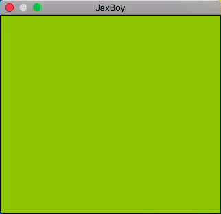
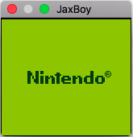
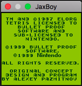

# JaxBoy
A WIP GameBoy emulator written in C++



## Description

JaxBoy is a [GameBoy](https://en.wikipedia.org/wiki/Game_Boy) emulator written in C++. Currently it can only play through the bootrom, and has very basic ROM loading support. It does not play any games yet. It is WIP and is very inaccurate and incomplete.

## Status

JaxBoy is currently not able to emulate any commercial games. It can currently boot Tetris to the loading copyright screen(this is the only ROM tested). Running the emulator requires that you have access to a GameBoy boot ROM image. It will play through the boot ROM pretty accurately without any graphical glitches.

The emulator currently runs too fast as there is no frame throttle yet. Compatibility is the main priority right now, so a throttle will not be implemented any time soon (better too fast than too slow, eh?).

## Screenshots




## Known game compatibility

Below is a compatibility table for JaxBoy.
Not all roms have been tested.

Key:
| `No stars` | Not tested |
| :star: | Not Playable |
| :star::star: | Boots to title screen |
| :star::star::star: | Playable with glitches |
| :star::star::star::star: | Perfect |

| Game | Compatibility | Notes |
| --- | --- | --- |
| Tetris | :star::star: | Boots to the copyright screen. |
| Super Mario Land | :star: | Does not boot |
| Donkey Kong | :star: | Does not boot |
| Pokemon Blue | :star: | Does not boot |

## Building and running

JaxBoy uses [make](https://www.gnu.org/software/make/), so building is simple.

Currently it is intended to be built on MacOS with clang, but it is easy to change the Makefile for your system/toolchain.

The only dependency for building is [MiniFB](https://github.com/emoon/minifb). Build that project and then place libminifb.a into `libs/`.

Then, to build simply run:
```
make run
```

## License

Licensed under the [Apache 2.0 License](http://www.apache.org/licenses/LICENSE-2.0)(see [LICENSE](LICENSE)).
