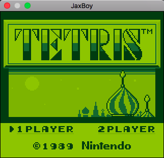
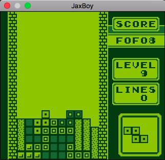
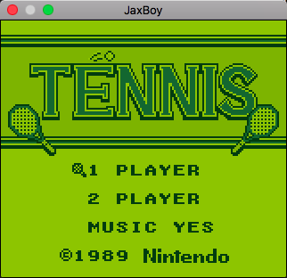
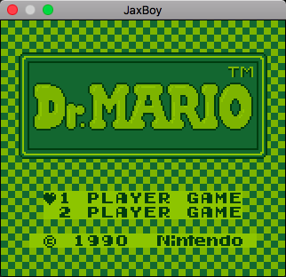
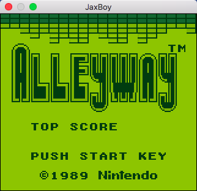
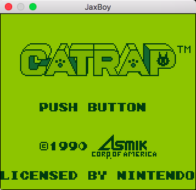
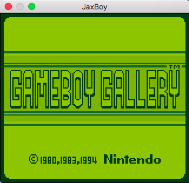
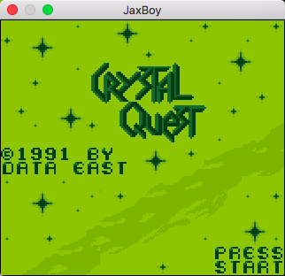

# JaxBoy
A WIP GameBoy emulator written in C++


## Description

JaxBoy is a [GameBoy](https://en.wikipedia.org/wiki/Game_Boy) emulator written in C++. The emulator is in the early stages and has very basic ROM loading support. It loads few games and has no controller support. It is WIP and is very inaccurate and incomplete.

## Status

JaxBoy is currently capable of emulating a few commercial games with varying levels of success. There are glitches and games are not playable without controller support.

Running the emulator requires that you have access to a GameBoy boot ROM image.

The emulator currently runs at varying speeds (usually too fast) as there is no frame throttle yet. Compatibility is the main priority right now, so a throttle will not be implemented any time soon (better it run too fast than too slow, eh?).

## Screenshots










## Known game compatibility

Below is a compatibility table for JaxBoy.
Only roms that have been tested are listed.

| Game | Compatibility | Notes |
| --- | --- | --- |
| Alleyway                                  | 🔵⚪️⚪️⚪️⚪️ |   Boots and starts game, with graphical errors. |
| Baseball                                  | ⚪️⚪️⚪️⚪️⚪️ |   Does not boot. |
| Castlelian                                | 🔵⚪️⚪️⚪️⚪️ |   Boots. Displays only alphabet on screen. |
| Castlevania Adventure                     | ⚪️⚪️⚪️⚪️⚪️ |   Does not boot. |
| Catrap                                    | 🔵⚪️⚪️⚪️⚪️ |   Boots to title screen. |
| Centipede                                 | 🔵⚪️⚪️⚪️⚪️ |   Cycles through splash screens and plays demo, with severe graphical errors. |
| Crystal Quest                             | 🔵🔵️⚪️⚪️⚪️ |   Boots and plays demo without graphical errors. |
| Donkey Kong                               | ⚪️⚪️⚪️⚪️⚪️ |   Does not boot. |
| Dr. Mario                                 | 🔵⚪️⚪️⚪️⚪️ |   Boots to title screen, but then hangs. |
| Dropzone                                  | 🔵🔵️⚪️⚪️⚪️ |   Boots to title screen and cycles through screens with minor graphical errors. |
| Flipull                                   | 🔵⚪️⚪️⚪️⚪️ |   Boots to title screen. |
| Game of Harmony, The                      | 🔵⚪️⚪️⚪️⚪️ |   Flips through a series of screens, then crashes. Has graphical errors. |
| Gameboy Gallery                           | 🔵⚪️⚪️⚪️⚪️ |   Boots to title screen, then crashes. |
| Kwirk                                     | 🔵🔵️️⚪️⚪️⚪️ |   Boots to title screen without graphical errors. |
| Legend of Zelda: Link's Awakening, The    | ⚪️⚪️⚪️⚪️⚪️ |   Does not boot. |
| Loopz                                     | ⚪️⚪️⚪️⚪️⚪️ |   Does not boot. |
| Missile Command                           | 🔵🔵️️⚪️⚪️⚪️ |   Boots to title screen and plays demo. |
| Motocross Maniacs                         | ⚪️⚪️⚪️⚪️⚪️ |   Does not boot. |
| NFL Football                              | ⚪️⚪️⚪️⚪️⚪️ |   Does not boot. |
| Othello                                   | 🔵⚪️⚪️⚪️⚪️ |   Boots to title screen, with minor graphical errors. |
| Palamedes                                 | 🔵🔵️⚪️⚪️⚪️ |   Boots to title screen. |
| Pipe Dream                                | 🔵🔵️⚪️⚪️⚪️ |   Cycles through splash screens and boots to title screen. |
| Pokemon Blue                              | ⚪️⚪️⚪️⚪️⚪️ |   Does not boot. |
| Pop Up                                    | 🔵⚪️⚪️⚪️⚪️ |   Boots to title screen. |
| Q Billion                                 | ⚪️⚪️⚪️⚪️⚪️ |   Does not boot. |
| Serpent                                   | 🔵⚪️⚪️⚪️⚪️ |   Boots to the title screen and plays demo, with severe graphical errors. |
| Shanghai                                  | 🔵🔵️️⚪️⚪️⚪️ |   Boots to title screen without graphical errors. |
| Spot                                      | 🔵⚪️⚪️⚪️⚪️ |   Boots to the title screen and plays demo. Graphical errors. |
| Super Mario Land                          | ⚪️⚪️⚪️⚪️⚪️ |   Does not boot. |
| Tasmania Story                            | ⚪️⚪️⚪️⚪️⚪️ |   Does not boot. |
| Tennis                                    | 🔵⚪️⚪️⚪️⚪️ |   Boots to the title screen. |
| Tesserae                                  | 🔵⚪️⚪️⚪️⚪️ |   Hangs at GAMETEK splash screen. |
| Tetris                                    | 🔵🔵️⚪️⚪️⚪️ |   Boots to the title screen, and runs the demo. |
| Wheel of Fortune                          | 🔵⚪️⚪️⚪️⚪️ |   Boots to main screen, severe graphical errors. |
| World Bowling                             | 🔵⚪️⚪️⚪️⚪️ |   Cycles through various game screens with severe graphical errors. |

## Building and running

JaxBoy uses [make](https://www.gnu.org/software/make/), so building is simple.

Currently it is intended to be built on MacOS with clang, but it is easy to change the Makefile for your system/toolchain.

The only dependency for building is [SDL2](https://www.libsdl.org/). Installing that varies by your operating system.

Then, to build simply run:
```
make run
```
To run:
```
./jaxboy <path_to_rom> <path_to_bootrom> <options>
```

## License

Licensed under the [Apache 2.0 License](http://www.apache.org/licenses/LICENSE-2.0)(see [LICENSE](LICENSE)).
