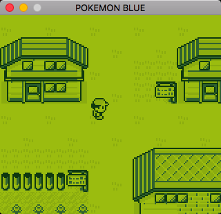
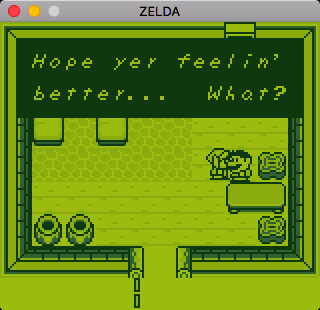
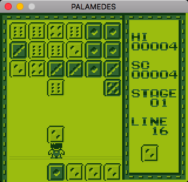
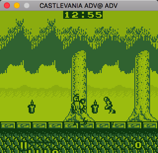

# JaxBoy
A WIP GameBoy emulator written in C++


## Description

JaxBoy is a [GameBoy](https://en.wikipedia.org/wiki/Game_Boy) emulator written in C++. It is WIP and very incomplete.

## Status

JaxBoy is currently capable of emulating a variety of commercial games with varying levels of success. There are inevitable glitches in all games, and many don't run at all.

Running the emulator requires that you have access to a GameBoy boot ROM image. If not, use a dummy bootrom.bin file and add the --skip-bootrom argument.

## Screenshots









## Known game compatibility

Below is a compatibility table for JaxBoy.
Only roms that have been tested are listed.

| Key | Definition |
| --- | --- |
| ⚪️⚪️⚪️⚪️⚪️ | Does not boot. |
| 🔵⚪️⚪️⚪️⚪️ | Boots to the title screen. |
| 🔵🔵⚪️⚪️⚪️ | Slighty playable. |
| 🔵🔵🔵️⚪️⚪️ | Plays through a signifcant portion of the game. |
| 🔵🔵🔵🔵⚪️ | Almost perfect with minor graphical errors. |
| 🔵🔵🔵🔵🔵 | Perfect emulation. |

| Game | Compatibility | Notes |
| --- | --- | --- |
| Alleyway                                  | 🔵🔵⚪️⚪️⚪️ |   Cannot control and hangs after dying. Major graphical glitches. |
| Baseball                                  | ⚪️⚪️⚪️⚪️⚪️ |   |
| Castlelian                                | 🔵🔵⚪️⚪️⚪️ |   First level unplayable. |
| Castlevania Adventure                     | 🔵🔵⚪️⚪️⚪️ |   Graphical errors. |
| Catrap                                    | 🔵🔵🔵🔵️⚪️ |   |
| Centipede                                 | 🔵🔵🔵️⚪️⚪️ |   Graphical errors. |
| Crystal Quest                             | 🔵🔵🔵🔵️⚪️ |   Minor graphical errors. |
| Donkey Kong                               | 🔵🔵🔵⚪️⚪️ |   Hangs after finishing first level. |
| Dr. Mario                                 | 🔵⚪️⚪️⚪️⚪️ |   Hangs when starting a game. |
| Dropzone                                  | 🔵️⚪️⚪️⚪️⚪️ |   Crashes on title screen. |
| Flipull                                   | 🔵🔵⚪️⚪️⚪️ |   Hangs when starting level. |
| Game of Harmony, The                      | 🔵🔵⚪️⚪️⚪️ |   Hangs ingame. |
| Gameboy Gallery                           | 🔵⚪️⚪️⚪️⚪️ |   Hangs on title screen. |
| Kwirk                                     | 🔵🔵🔵️⚪️⚪️ |   Minor graphical errors. |
| Legend of Zelda: Link's Awakening, The    | 🔵🔵⚪️⚪️⚪️ |   Crashes when leaving the house. |
| Loopz                                     | ⚪️⚪️⚪️⚪️⚪️ |   |
| Missile Command                           | 🔵🔵️️⚪️⚪️⚪️ |   Major graphical errors. |
| Motocross Maniacs                         | ⚪️⚪️⚪️⚪️⚪️ |   |
| NFL Football                              | ⚪️⚪️⚪️⚪️⚪️ |   |
| Othello                                   | 🔵🔵⚪️⚪️⚪️ |   Hangs ingame. |
| Palamedes                                 | 🔵🔵🔵🔵️⚪️ |   Minor graphical errors. |
| Pipe Dream                                | 🔵🔵⚪️⚪️⚪️ |   Major graphical errors. |
| Pokemon Blue                              | 🔵🔵⚪️⚪️⚪️ |   Crashes when entering name screen or using an attack. |
| Pokemon Red                               | 🔵🔵⚪️⚪️⚪️ |   Crashes when entering name screen or using an attack. |
| Pop Up                                    | 🔵🔵🔵⚪️⚪️ |   |
| Q Billion                                 | ⚪️⚪️⚪️⚪️⚪️ |   |
| Serpent                                   | 🔵🔵⚪️⚪️⚪️ |   Severe graphical errors. |
| Shanghai                                  | ⚪️⚪️⚪️⚪️⚪️ |   |
| Spot                                      | 🔵⚪️⚪️⚪️⚪️ |   |
| Super Mario Land                          | ⚪️⚪️⚪️⚪️⚪️ |   |
| Tasmania Story                            | 🔵🔵⚪️⚪️⚪️ |   No idea how to play. |
| Tennis                                    | 🔵🔵🔵🔵⚪️ |   |
| Tesserae                                  | 🔵⚪️⚪️⚪️⚪️ |   Hangs at GAMETEK splash screen. |
| Tetris                                    | 🔵🔵🔵🔵️️⚪️ |   Only spawns one block type and adds score incorrectly. |
| Wheel of Fortune                          | 🔵⚪️⚪️⚪️⚪️ |   Hangs on splash screen. |
| World Bowling                             | 🔵🔵🔵⚪️⚪️ |   Graphical errors. |

## Building and running

JaxBoy uses [make](https://www.gnu.org/software/make/), so building is simple.

Currently it is intended to be built on MacOS with clang, but it is easy to change the Makefile for your system/toolchain.

The only dependency for building is [SDL2](https://www.libsdl.org/). Installing that varies by your operating system.

Then, to build simply run:
```
make run
```
To run:
```
./jaxboy <path_to_rom> <path_to_bootrom> <options>
```

## License

Licensed under the [Apache 2.0 License](http://www.apache.org/licenses/LICENSE-2.0)(see [LICENSE](LICENSE)).
