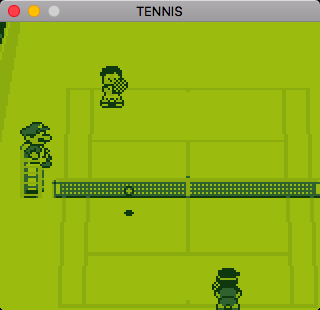

# JaxBoy
A WIP GameBoy emulator written in C++


## Description

JaxBoy is a [GameBoy](https://en.wikipedia.org/wiki/Game_Boy) emulator written in C++. The emulator is in the early stages and has very basic ROM loading support. It loads few games and has no controller support. It is WIP and is very inaccurate and incomplete.

## Status

JaxBoy is currently capable of emulating a few commercial games with varying levels of success. There are glitches and games are not playable without controller support.

Running the emulator requires that you have access to a GameBoy boot ROM image.

The emulator currently runs at varying speeds (usually too fast) as there is no frame throttle yet. Compatibility is the main priority right now, so a throttle will not be implemented any time soon (better it run too fast than too slow, eh?).

## Screenshots





## Known game compatibility

Below is a compatibility table for JaxBoy.
Only roms that have been tested are listed.

| Game | Compatibility | Notes |
| --- | --- | --- |
| Alleyway                                  | ⚪️⚪️⚪️⚪️⚪️ |   Does not boot. |
| Baseball                                  | ⚪️⚪️⚪️⚪️⚪️ |   Does not boot. |
| Castlevania Adventure                     | ⚪️⚪️⚪️⚪️⚪️ |   Does not boot. |
| Donkey Kong                               | ⚪️⚪️⚪️⚪️⚪️ |   Does not boot. |
| Dr. Mario                                 | 🔵⚪️⚪️⚪️⚪️ |   Boots to title screen, but then hangs. |
| Legend of Zelda, The: Link's Awakening    | ⚪️⚪️⚪️⚪️⚪️ |   Does not boot. |
| Pokemon Blue                              | ⚪️⚪️⚪️⚪️⚪️ |   Does not boot. |
| Super Mario Land                          | ⚪️⚪️⚪️⚪️⚪️ |   Does not boot. |
| Tennis                                    | 🔵⚪️⚪️⚪️⚪️ |   Boots to the title screen. Cannot play without controls. |
| Tetris                                    | 🔵⚪️⚪️⚪️⚪️ |   Boots to the title screen. Score is incorrecly counted. |

## Building and running

JaxBoy uses [make](https://www.gnu.org/software/make/), so building is simple.

Currently it is intended to be built on MacOS with clang, but it is easy to change the Makefile for your system/toolchain.

The only dependency for building is [MiniFB](https://github.com/emoon/minifb). Build that project and then place libminifb.a into `libs/`.

Then, to build simply run:
```
make run
```
To run:
```
./jaxboy <path_to_rom> <path_to_bootrom> <options>
```

## License

Licensed under the [Apache 2.0 License](http://www.apache.org/licenses/LICENSE-2.0)(see [LICENSE](LICENSE)).
